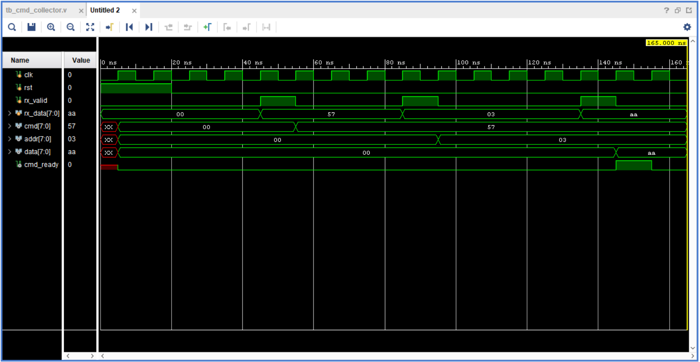

# cmd_collector Testbench

This directory contains the testbench and documentation for the
`cmd_collector` module used in the UART register-file project.

## Overview
The `cmd_collector` module groups UART-received bytes into a fixed-length
3-byte command consisting of:
- Command (CMD)
- Address (ADDR)
- Data (DATA)

The testbench verifies correct byte sequencing and generation of a
single-cycle `cmd_ready` pulse once a complete command is received.

## Test Scenario
The testbench simulates UART byte reception using `rx_valid` pulses with
gaps between bytes to reflect realistic timing.

**Input sequence:**
- `0x57` (CMD = 'W')
- `0x03` (ADDR)
- `0xAA` (DATA)

**Expected behavior:**
- `cmd` captures `0x57`
- `addr` captures `0x03`
- `data` captures `0xAA`
- `cmd_ready` asserts for one clock cycle after the third byte

## Waveform
The waveform below shows the byte-by-byte capture process and the
assertion of `cmd_ready` after the complete command is collected.

