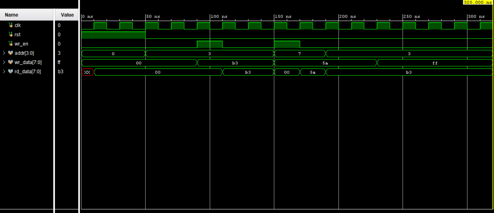

# Register File Testbench

This testbench verifies a simple 16×8 register file.

## What is tested
- Synchronous write on rising clock edge
- Asynchronous read
- Write enable gating
- Addressed register isolation
- Reset behavior

## Files
- `tb_reg_file_16x8.v` – Testbench
- `reg_file_waveform.png` – Vivado simulation waveform

## Waveform

