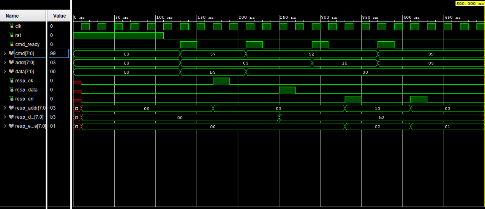

# UART Register File – Integration Testbench

This testbench verifies the integrated **command decoder + register file** block
(`uart_regfile_core`) using a simple, simulation-only flow.

The goal is to confirm that UART-style commands correctly:
- Write data into the register file
- Read data back from the register file
- Generate appropriate response signals

---

## What This Testbench Tests

The testbench drives complete command packets directly into the DUT
(as if they were already decoded from UART RX):

### 1️⃣ Write Command
- Command: `'W'` (0x57)
- Address: `0x03`
- Data: `0xB3`
- Expected response: `resp_ok` (`'K'`)

### 2️⃣ Read Command
- Command: `'R'` (0x52)
- Address: `0x03`
- Expected response:
  - `resp_data` (`'D'`)
  - `resp_data_byte = 0xB3`

### 3️⃣ Error Handling (Optional Checks)
- Invalid address → `resp_err` with error code `0x02`
- Unknown command → `resp_err` with error code `0x01`

---

## Waveform Snapshot

The waveform below shows:
- Command sequencing
- Register write enable pulse
- Correct register readback
- Response signal timing

---

## Notes

- This is an **integration-level testbench**
- UART bit-level TX/RX is intentionally bypassed here
- Focus is on **control flow, FSM behavior, and data integrity**
- Designed for **Vivado behavioral simulation**

---

## Files

- `tb_uart_regfile_core.v` – Integration testbench
- `waveform.png` – Simulation waveform snapshot

